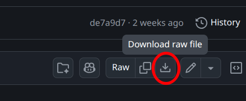
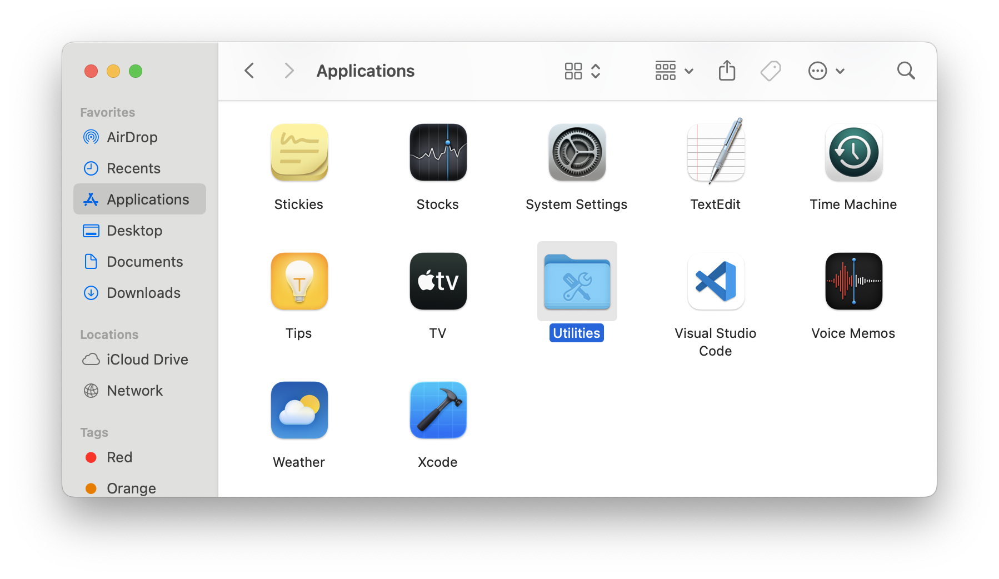
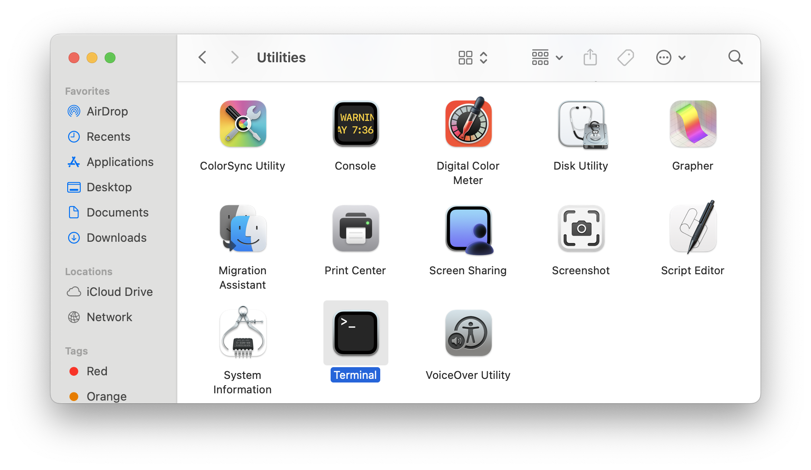
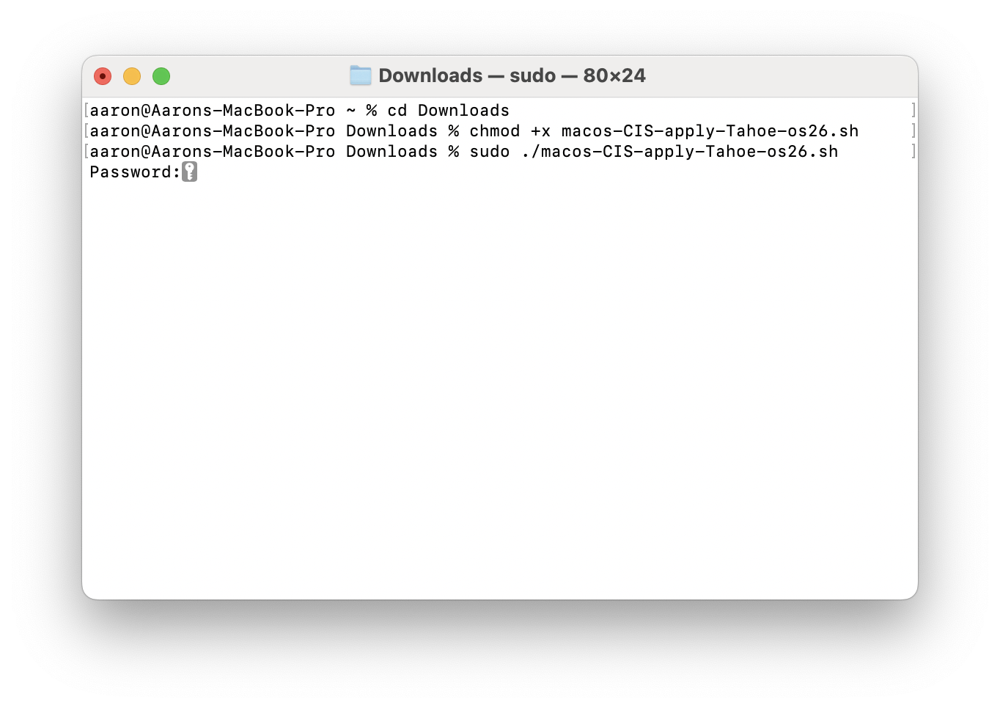
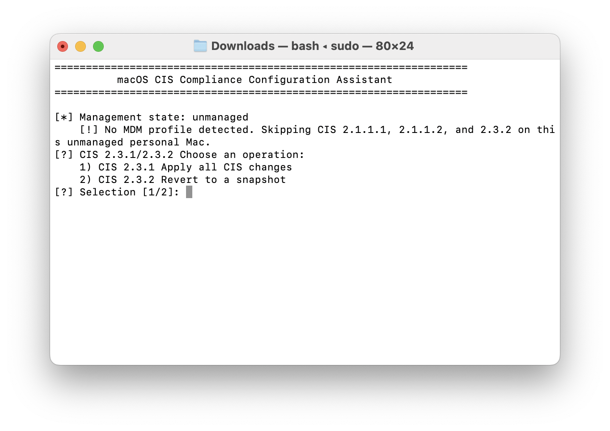
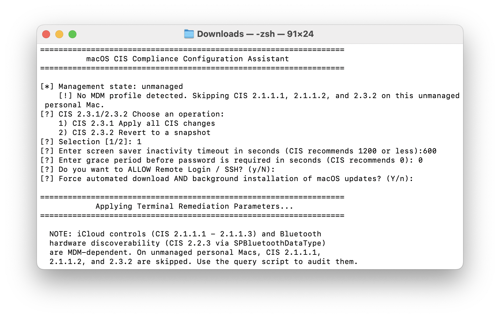
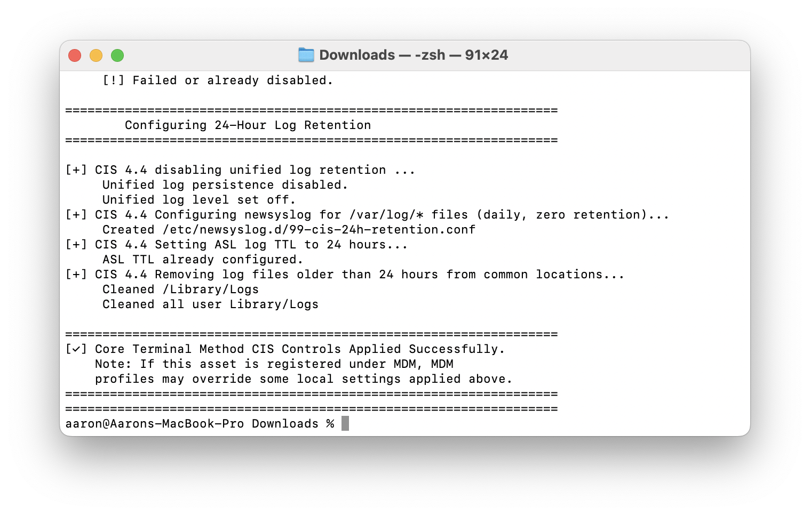

# Installation Instructions

**Download the Script**
Open this link in your browser:<br>
https://github.com/aaronfosdick/macos-CIS/blob/master/macos-CIS-apply-Tahoe-os26.sh<br>
In the upper right of the page, click on the small download icon to download the file to the Downloads folder on your laptop




**Open Finder -> Applications -> Utilities:** 




**Open the "Terminal" application:** 




**Once Teminal is open, type in these three commands, press Return after each. (you can also copy/paste) :** 
```
cd Downloads
chmod +x macos-CIS-apply-Tahoe-os26.sh
sudo ./macos-CIS-apply-Tahoe-os26.sh
```
_enter your macbook password when prompted_




**The script will start and will ask you some questions: **
**Choose 1 to Apply all CIS changes:** 



**The script will ask a few more questions, default choices are in CAPS:**<br> 
Set Screen Saver inactivity to 600 seconds (10 minutes)<br>
Grace Period is the amount of time after the screen goes blank that it locks. Either 0 or 10 seconds is fine.<br>
Remote Login: No<br>
Automated Updates: Yes<br>
Other choices: Yes




**Once finished, you will see a prompt line with the "%". You can now quit the terminal application** 

